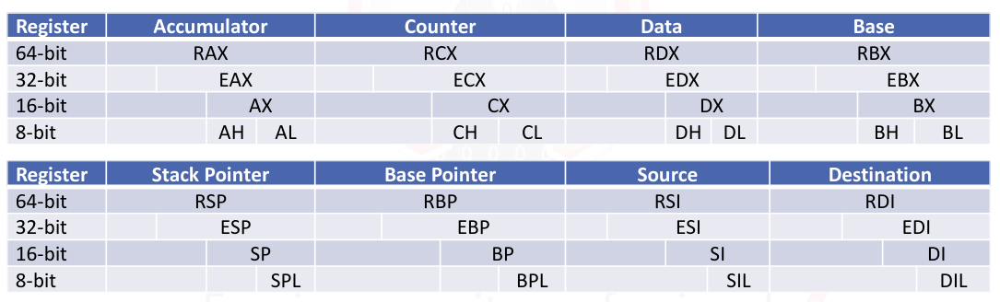

# system security
- purpose of sys sec module: fund concepts to improve skills in fuzzing, exploit dev, bo, debugging, reversing, and malware analysis
- focus on windows
## architecture fundementals
- cpu: in charge of executing machine code
	- represented in hex
	- assembly: nasm, masm (microsoft macro asm)
	- all have own instruction set architecture (isa)
		- memory, reg, instructions
		- most common x86
- registers
	- 32 or 64 bit refers to width of cpu reg
	- kinda like temp variables to store data
	- some specific funx, some general storage
	- general purpose reg (gpr)

|x86 name|name|purpose|
|-|-|-|
|eax|accumulator|arithmetic operation|
|ecx|counter|shift instruction and loops|
|edx|data|arithmetic operation and i/o|
|ebx|base|pointer|
|esp|stack pt|top of stack|
|ebp|base|pt to data|
|esi|src index|pt to source in stream operation|
|edi|destination|pt to dest in stream operation|

- reg cont'd
	- naming convention of old  8 bit cpu
		- low byte w L and high byte w H
	- 16 bit: combine l and h with an x
		- stack pt, base pt, src, and dest, just remove l
	- 32 bit: register prefix w e (extended)
	- 64 bit: e replace with r

